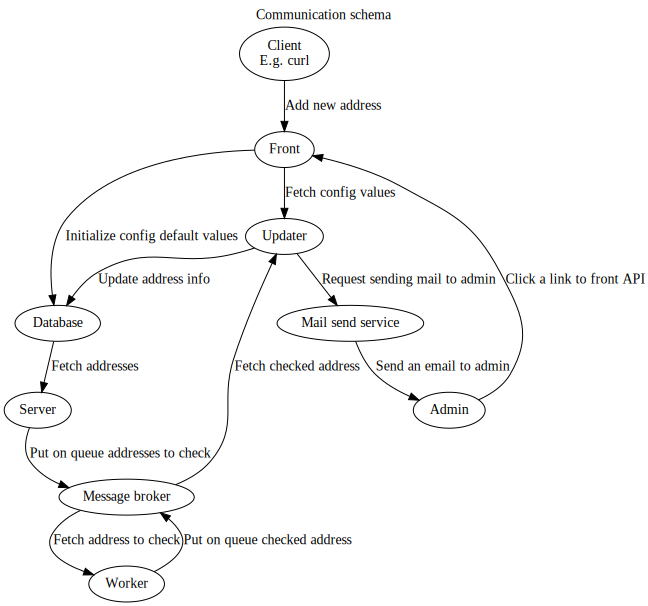

Setup docker network for the containters using `docker network create healthcheck-network`.

Run `./copy-messages-models-jars.sh` to copy messages and models jars. Set up message-broker and database component at first, then run database-schema.

